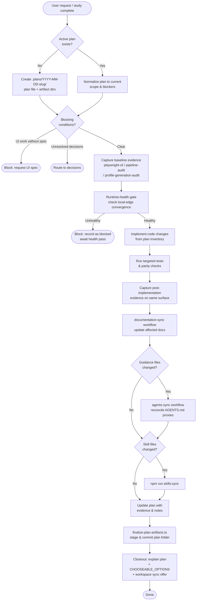

# plan
Execution bridge that converts completed studies and analysis artifacts into deterministic implementation plans with evidence-first quality gates, then shepherds delivery through browser validation, documentation sync, and guidance reconciliation before closure.

## Install

The fastest cross-agent install path is the `skills` CLI:

```bash
npx skills add gg-skills/plan
```

Drop this skill into a workspace as a Git submodule for pinned versions, or as a plain clone for latest `main`:

```bash
# Project-local, version-pinned:
git submodule add git@github.com:gg-skills/plan.git .claude/skills/plan

# OR project-local, latest main:
mkdir -p .claude/skills
git -C .claude/skills clone git@github.com:gg-skills/plan.git

# OR user-level, available in every project on this machine:
mkdir -p ~/.claude/skills
git -C ~/.claude/skills clone git@github.com:gg-skills/plan.git
```

Restart your agent or reload skills after installation. See the parent [`skills` catalog repo](https://github.com/gg-skills/skills) for the full catalog.

## When to use

- User asks to execute a plan end-to-end.
- A study is complete and execution planning or implementation is requested.
- A Codex-session analysis produced execution-ready inventory items.
- A persisted plan artifact exists but lacks deterministic execution sequencing.
- Work requires evidence-first browser validation before implementation.
- Canonical `AGENTS.md` content or `CLAUDE.md` / `GEMINI.md` proxy stubs are modified.

**Skip when:** the task is pure research (use `research-online`), a single trivial file edit with no plan artifact needed, or the user explicitly wants only a study (use `study`).

## How it operates

### Inputs

| Source | Detail |
|---|---|
| **Conversation context** | Active task description, user intent, explicit sub-agent preference |
| **Plan artifact** | `.plans/YYYY-MM-DD-<slug>/plan-<slug>-YYYY-MM-DD.md` — read if it already exists; created if not |
| **Study artifact** | Output of `study` (any path the user or plan references); optional when noted as `No study provided` |
| **Codex-session inventory** | `codex-sessions` workflow improvement inventory; accepted as a substitute for a full study |
| **UI spec artifact** | Required for any DOM/CSS change; must be linked in the study or plan before implementation |
| **Local screenshot evidence** | Resolvable local file paths under `artifacts/baseline/` and `artifacts/post/` |
| **Runtime health state** | Derived by inspecting local-edge convergence artifacts or direct localhost probes |
| **Skills/agents guidance files** | `AGENTS.md`, `CLAUDE.md`, `GEMINI.md` — read when guidance reconciliation is in scope |

### Outputs

| Artifact | Path / format |
|---|---|
| **Plan document** | `.plans/YYYY-MM-DD-<slug>/plan-<slug>-YYYY-MM-DD.md` (Markdown) |
| **Baseline evidence** | `.plans/…/artifacts/baseline/` — screenshots, audit directories |
| **Post-implementation evidence** | `.plans/…/artifacts/post/` — screenshots, audit directories |
| **Runtime-health artifacts** | `.plans/…/artifacts/runtime-health/` |
| **Wave-gate artifacts** | `.plans/…/artifacts/wave-gates/` |
| **Execution artifacts** | `.plans/…/artifacts/execution/` |
| **Finalize script JSON** | stdout from `finalize-plan-artifacts.ts` — plan path, commit SHA, staged files |
| **Temporary scratch** | `.tmp/plan/YYYY-MM-DD-{subject}/` (gitignored) |

### External commands

| Command | Purpose |
|---|---|
| `npx tsx skills/plan/scripts/finalize-plan-artifacts.ts --plan-dir <path>` | Stage and publish a plan folder; prints JSON result |
| `npx tsx … --latest` | Auto-resolve newest `YYYY-MM-DD-*` folder and publish |
| `npx tsx … --dry-run` | Validate without staging or committing |
| `npm run skills:sync` | Rebuild skill indexes after any skill-file change |
| `npm run agents:sync` | Reconcile `CLAUDE.md` / `GEMINI.md` proxy stubs after `AGENTS.md` changes |
| **`playwright-cli` workflow** | Capture browser screenshots for baseline and post-implementation evidence |
| **`pipeline-auditing` workflow** | Scenario/replay/latency/cache audit evidence |
| **`profile-generation-audit` workflow** | Turn/thread/persistence/publication-state audit evidence |
| **`documentation-sync` workflow** | Reconcile affected docs after behavior changes |
| **`agents-sync` workflow** | Sync guidance files when `AGENTS.md` or proxy stubs change |

### Side effects

- Creates and commits `.plans/…` artifact tree to git via `publishScopedArtifacts`.
- May stage and commit guidance file updates when `agents-sync` runs.
- Runs `npm run skills:sync` (writes skill indexes) when skill files change.
- Browser evidence sessions produce screenshot files on the local filesystem.

### Mode toggles

| Toggle | Effect |
|---|---|
| **Single-threaded (default)** | Coordinating agent owns the plan file end-to-end |
| **Sub-agent fan-out** | Enabled only when user explicitly requests; bounded drafting lane + narrow reviewer lanes; coordinating agent remains final file owner |
| **`--dry-run`** | `finalize-plan-artifacts.ts` validates layout without writing to git |
| **`--latest`** | Auto-resolve newest plan folder without specifying a path |

## Operational flow



## Layout

```
plan/
├── SKILL.md                          # Full skill contract (triggers, policy, sequence)
├── README.md                         # This file
├── agents/
│   └── openai.yaml                   # OpenAI Agents SDK interface definition
├── assets/
│   ├── icon-large.png
│   ├── icon-large.svg
│   ├── icon-master.png
│   └── icon-small.svg
└── scripts/
    └── finalize-plan-artifacts.ts    # CLI: stage & publish .plans/ artifact tree
```

## Quick start

```bash
# 1. Activate the skill in your Claude Code project
git submodule add git@github.com:gg-skills/plan.git .claude/skills/plan

# 2. Start a plan session — Claude will create the .plans/ artifact automatically
# "Execute this plan" or "generate an implementation plan from the study at .studies/…"

# 3. Publish completed plan artifacts
npx tsx skills/plan/scripts/finalize-plan-artifacts.ts --latest

# 4. Dry-run to validate without committing
npx tsx skills/plan/scripts/finalize-plan-artifacts.ts --plan-dir ".plans/2026-05-17-my-task" --dry-run
```

## Resources

- [SKILL.md](SKILL.md) — full trigger list, non-negotiable policy, deterministic sequence, CHOOSEABLE_OPTIONS contract, and troubleshooting table
- [scripts/finalize-plan-artifacts.ts](scripts/finalize-plan-artifacts.ts) — plan artifact publisher (reads `.plans/`, validates layout, delegates to `publishScopedArtifacts`)
- [agents/openai.yaml](agents/openai.yaml) — OpenAI Agents SDK interface definition
- Parent collection: [gg-skills](https://github.com/gg-skills/skills)

## Caveats

- **Evidence-first is non-negotiable.** No code edit may begin before baseline evidence is captured; no fast path bypasses this gate regardless of perceived simplicity.
- **Plan file is source of truth.** Chat-only state drifts. Patch the `.plans/…` file whenever scope, sequencing, or blockers change.
- **Sub-agents never own the final plan file.** Even when fan-out is enabled, the coordinating agent integrates all drafts before writing the plan.
- **`finalize-plan-artifacts.ts` requires `tsx` and the shared helper** at `scripts/shared/finalize-scoped-artifact.ts` in the consuming repo. The script errors if that helper is absent.
- **Local-edge startup transients are not terminal.** Wait for `npm run local` service convergence before judging runtime health; do not block execution on transient startup failures.
- **`npm run agents:sync` must complete before closure** whenever any guidance file (`AGENTS.md`, `CLAUDE.md`, `GEMINI.md`) was modified; closure without this step is a policy violation.
